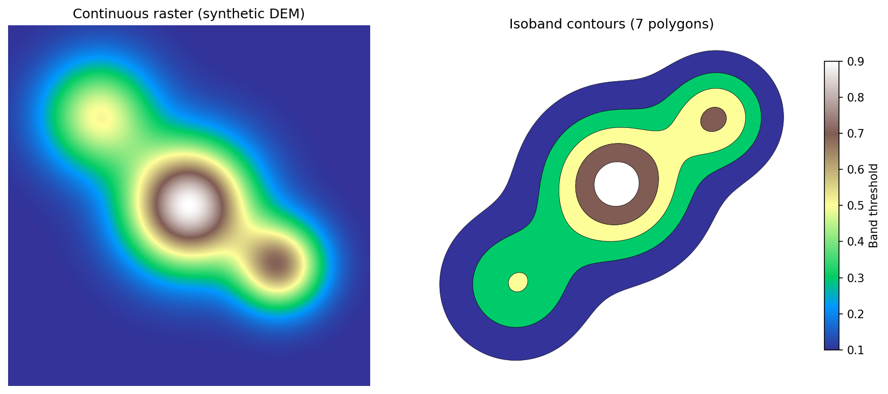

# contourrs

Fast raster polygonization and contouring in pure Rust with Python bindings. Drop-in replacement for `rasterio.features.shapes` — no GDAL dependency.

Converts discrete/categorical rasters (segmentation masks, land cover, classified imagery) into vector polygons with their pixel values. Also supports continuous-field contouring (DEMs, probability maps, heatmaps) via marching squares isobands. Built for the ML-to-GIS pipeline: model inference output goes in, GeoJSON or GeoParquet comes out.

## Example outputs


## Install

```bash
pip install contourrs
```

## Development

```bash
git clone https://github.com/isaaccorley/contourrs.git
cd contourrs
uv sync --extra dev
uv run maturin develop --release
uv run pytest tests/ -v
```

Pre-commit hooks:

```bash
uv run pre-commit install
uv run pre-commit run --all-files
```

## Usage

### Polygonize (discrete/categorical rasters)

```python
import numpy as np
from contourrs import shapes

raster = np.array([[1, 1, 2], [1, 2, 2], [3, 3, 3]], dtype=np.uint8)

for geojson, value in shapes(raster, connectivity=4):
    print(f"value={value}, type={geojson['type']}")
```


### Contours (continuous rasters)

```python
import numpy as np
from contourrs import contours

dem = np.random.default_rng(42).random((256, 256)).astype(np.float32)

for geojson, value in contours(dem, thresholds=[0.25, 0.5, 0.75]):
    print(f"band={value}, rings={len(geojson['coordinates'])}")
```



### Arrow output (zero-copy, GeoParquet-ready)

```python
from contourrs import shapes_arrow, contours_arrow

# Discrete raster → Arrow Table
table = shapes_arrow(raster, connectivity=4)

# Continuous raster → Arrow Table
table = contours_arrow(dem, thresholds=[0.25, 0.5, 0.75])

# table.schema: geometry (binary/WKB), value (float64)
# GeoParquet metadata included — write directly:
import pyarrow.parquet as pq
pq.write_table(table, "output.parquet")
```

### Convert to GeoPandas

Both `shapes_arrow()` and `contours_arrow()` return tables with GeoParquet metadata, so GeoPandas can read them directly:

```python
import geopandas as gpd

gdf = gpd.GeoDataFrame.from_arrow(shapes_arrow(raster))
gdf = gpd.GeoDataFrame.from_arrow(contours_arrow(dem, thresholds=[0.25, 0.5, 0.75]))
```

### With affine transform and mask

```python
transform = (10.0, 0.0, 500000.0, 0.0, -10.0, 4500000.0)  # (a, b, c, d, e, f)
mask = raster != 0  # exclude nodata

shapes(raster, mask=mask, connectivity=8, transform=transform)
contours(dem, thresholds=[0.25, 0.5, 0.75], mask=mask, transform=transform)
```

### Real-world tiled workflow (USDA CDL)

Download a real Cropland Data Layer county tile, polygonize in blocks, and merge
touching polygons with the same class across tile boundaries:

```bash
python examples/cdl_tiled_polygonize.py --year 2023 --fips 19153 --tile-size 1024
```

Writes merged output as GeoParquet in `examples/output/`.


### DEM contour examples (synthetic + real)

Generate contour visualizations from both a synthetic surface and a cached
Mount Rainier DEM tile:

```bash
python examples/dem_contour.py
```

This writes two plots into `assets/` and `docs/assets/`:

- `contours_synthetic.png`
- `contours_mt_rainier.png`


## API

### `shapes(source, mask=None, connectivity=4, transform=None)`

Returns `list[tuple[dict, float]]` — GeoJSON geometry dicts paired with pixel values. Signature matches `rasterio.features.shapes`.

**Parameters:**
- `source` — 2D numpy array (uint8/16/32, int16/32, float32/64)
- `mask` — optional 2D bool array (True = include)
- `connectivity` — `4` or `8` pixel neighborhood
- `transform` — 6-element affine tuple `(a, b, c, d, e, f)`

### `shapes_arrow(source, mask=None, connectivity=4, transform=None)`

Returns `pyarrow.Table` with columns:
- `geometry` — Binary (WKB-encoded polygons)
- `value` — Float64

Schema includes GeoParquet metadata. 5-6x faster than `shapes()` at scale by eliminating Python dict overhead.

### `contours(source, thresholds, mask=None, transform=None)`

Returns `list[tuple[dict, float]]` — GeoJSON geometry dicts paired with the lower threshold of each band. Uses marching squares to produce filled isoband polygons between consecutive threshold pairs.

**Parameters:**
- `source` — 2D numpy array (uint8/16/32, int16/32, float32/64)
- `thresholds` — list of break values (at least 2); bands formed from consecutive pairs
- `mask` — optional 2D bool array (True = include)
- `transform` — 6-element affine tuple `(a, b, c, d, e, f)`

### `contours_arrow(source, thresholds, mask=None, transform=None)`

Same as `contours()` but returns a `pyarrow.Table` with WKB geometry and GeoParquet metadata.

## Performance

Benchmarked against `rasterio.features.shapes` (`GDALPolygonize` under the hood) on random categorical rasters ([benchmark script](scripts/benchmark.py)):

| Grid size | Values | `shapes()` | `rasterio` | Speedup |
|-----------|--------|------------|------------|---------|
| 64x64 | 5 | 0.3ms | 0.7ms | 2.4x |
| 256x256 | 5 | 6ms | 14ms | 2.3x |
| 1024x1024 | 5 | 105ms | 190ms | 1.8x |
| 2048x2048 | 5 | 680ms* | 5,380ms | 7.9x |

*\*`shapes_arrow()` — eliminates Python GeoJSON dict construction.*

## Architecture

**Polygonize** — two-pass algorithm mirroring GDAL's `GDALPolygonize`:

1. **Region labeling** — connected-component labeling via union-find with path compression. Supports 4- and 8-connectivity with optional mask.
2. **Boundary tracing** — direct contour tracing with turn-priority logic. Classifies exterior rings (CCW) and holes (CW). Applies affine transform to output coordinates.

**Contours** — two-isoline marching squares decomposition:

1. For each band [lo, hi), run standard 16-case marching squares at both thresholds.
2. Set-difference the resulting rings: lo-exteriors become isoband boundaries, hi-exteriors become holes.
3. Interpolation along cell edges places boundaries at sub-pixel precision.

**Workspace layout:**
- `contourrs` — pure Rust library, returns `geo_types::Polygon<f64>`
- `contourrs-python` — PyO3/maturin bindings

**Feature flags** (Rust crate):
- `arrow` — Arrow RecordBatch export with WKB geometry + GeoParquet metadata
- `cuda` — GPU-accelerated connected-component labeling (scaffolded, requires CUDA toolkit)

## Limitations vs GDAL

contourrs reimplements GDAL's polygonize algorithm in pure Rust but is not a full replacement for the GDAL ecosystem. Key differences:

| Feature | GDAL | contourrs |
|---|---|---|
| Large rasters | Scanline-based, disk-backed | Full array must fit in memory |
| File I/O | Reads any GDAL/OGR raster/vector format | Array-in, GeoJSON/Arrow out |
| CRS propagation | Automatic from source dataset | Manual — caller attaches CRS |
| Nodata handling | Auto from band metadata / mask band | Explicit bool mask required |
| Simplification | Ecosystem tools (`ogr2ogr`, PostGIS) | None — bring your own (e.g. `shapely.simplify`) |
| Dtypes | int8–64, uint8–64, float, complex | u8/16/32, i16/32, f32/64 |
| Progress reporting | Callback API | None |

**When to use GDAL instead:** streaming very large rasters that exceed RAM, need direct format conversion (e.g. GeoTIFF → GeoPackage), or require CRS-aware output layers.

**When contourrs wins:** in-memory ML/CV pipelines where speed matters, Arrow/GeoParquet-first workflows, environments where installing GDAL is painful, and isoband contouring (GDAL's `gdal_contour` produces isolines, not filled isobands).

## Acknowledgments

Built by [Isaac Corley](https://github.com/isaaccorley) with [Claude](https://claude.ai) as an AI pair-programmer. The Rust core, Python bindings, and packaging were developed iteratively with human-in-the-loop feedback and review.

## License

Apache-2.0
