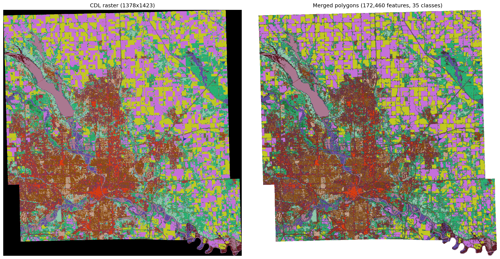
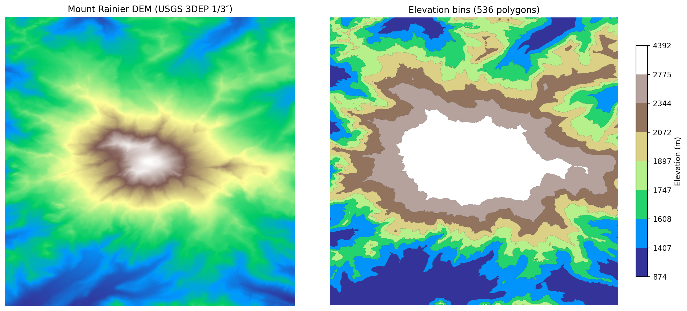

# Examples

## Basic polygonization

```python
import numpy as np
from contourrs import shapes

raster = np.array([
    [1, 1, 2],
    [1, 2, 2],
    [3, 3, 3],
], dtype=np.uint8)

for geojson, value in shapes(raster, connectivity=4):
    print(f"value={value}, type={geojson['type']}")
```

## Basic contouring

```python
import numpy as np
from contourrs import contours

dem = np.random.default_rng(42).random((256, 256)).astype(np.float32)

for geojson, value in contours(dem, thresholds=[0.25, 0.5, 0.75]):
    print(f"band={value}, rings={len(geojson['coordinates'])}")
```

## Arrow output and GeoParquet

Arrow variants return a `pyarrow.Table` with WKB geometry and GeoParquet metadata — write directly to parquet:

```python
from contourrs import shapes_arrow, contours_arrow
import pyarrow.parquet as pq

# Discrete raster
raster = np.random.randint(0, 5, (512, 512), dtype=np.uint8)
table = shapes_arrow(raster, connectivity=4)
pq.write_table(table, "polygons.parquet")

# Continuous raster
dem = np.random.default_rng(42).random((512, 512)).astype(np.float32)
table = contours_arrow(dem, thresholds=[0.2, 0.4, 0.6, 0.8])
pq.write_table(table, "contours.parquet")
```

## Convert to GeoPandas

Both Arrow functions return tables with GeoParquet metadata, so GeoPandas reads them directly:

```python
import geopandas as gpd
import numpy as np
from contourrs import shapes_arrow, contours_arrow

raster = np.random.randint(0, 5, (256, 256), dtype=np.uint8)
gdf = gpd.GeoDataFrame.from_arrow(shapes_arrow(raster))

dem = np.random.default_rng(42).random((256, 256)).astype(np.float32)
gdf = gpd.GeoDataFrame.from_arrow(contours_arrow(dem, thresholds=[0.25, 0.5, 0.75]))
```

## Using a mask

Exclude pixels from processing (e.g. nodata regions):

```python
import numpy as np
from contourrs import shapes

raster = np.array([
    [0, 1, 1],
    [0, 2, 2],
    [3, 3, 3],
], dtype=np.uint8)

mask = raster != 0  # exclude nodata
results = shapes(raster, mask=mask, connectivity=4)
```

## With affine transform

Apply a georeferencing transform to output coordinates:

```python
import numpy as np
from contourrs import shapes, contours

raster = np.random.randint(0, 5, (256, 256), dtype=np.uint8)
dem = np.random.default_rng(42).random((256, 256)).astype(np.float32)

# (a, b, c, d, e, f) — 10m pixel, UTM origin
transform = (10.0, 0.0, 500000.0, 0.0, -10.0, 4500000.0)

results = shapes(raster, connectivity=8, transform=transform)
results = contours(dem, thresholds=[0.25, 0.5, 0.75], transform=transform)
```

## 8-connectivity

Use 8-connectivity to merge diagonally-adjacent pixels:

```python
import numpy as np
from contourrs import shapes

raster = np.array([
    [1, 0, 1],
    [0, 1, 0],
    [1, 0, 1],
], dtype=np.uint8)

# 4-connectivity: each "1" pixel is a separate region
results_4 = shapes(raster, connectivity=4)

# 8-connectivity: diagonal "1" pixels merge into one region
results_8 = shapes(raster, connectivity=8)
```

## Mask + transform + Arrow (full pipeline)

Combine all features for a complete ML-to-GIS pipeline:

```python
import numpy as np
import pyarrow.parquet as pq
from contourrs import shapes_arrow

# Simulated model output
predictions = np.random.randint(0, 10, (1024, 1024), dtype=np.uint8)
confidence = np.random.random((1024, 1024)) > 0.1  # mask low-confidence

transform = (10.0, 0.0, 500000.0, 0.0, -10.0, 4500000.0)

table = shapes_arrow(
    predictions,
    mask=confidence,
    connectivity=4,
    transform=transform,
)
pq.write_table(table, "predictions.parquet")
```

## Real-world data: tiled USDA CDL polygonization + merge

Walkthrough notebook: [`examples/cdl_tiled_polygonize.ipynb`](https://github.com/isaaccorley/contourrs/blob/main/examples/cdl_tiled_polygonize.ipynb)

Rendered tutorial page: [Tiled polygonization tutorial](tutorials/cdl_tiled_polygonize.md)

The notebook includes:

1. A deterministic synthetic tiled run (always runnable)
2. A merge step that dissolves class-matching neighbors across tile seams
3. A side-by-side raster vs polygon plot
4. An optional real USDA CDL run (disabled in CI by default)

Output is written as GeoParquet in `examples/output/` (real runs) or a temp path (synthetic runs).

The tutorial writes a side-by-side raster vs merged polygon visualization:



## Real-world + synthetic DEM contour plots

Walkthrough notebook: [`examples/dem_contour.ipynb`](https://github.com/isaaccorley/contourrs/blob/main/examples/dem_contour.ipynb)

Rendered tutorial page: [DEM contour tutorial](tutorials/dem_contour.md)

The notebook demonstrates both:

1. A synthetic DEM contour plot (fast, deterministic)
2. A real Mount Rainier contour plot from a cached USGS 3DEP tile (if available)

Outputs:

- `assets/contours_synthetic.png`
- `assets/contours_mt_rainier.png`

Example output (real DEM):



## End-to-end TorchGeo FTW segmentation -> contourrs polygons

Run TorchGeo's FTW U-Net model (`Unet_Weights.SENTINEL2_FTW_PRUE_CCBY_EFNETB3`) on a
Fields of the World sample, then polygonize only class index `1` using
`contourrs.shapes`.

Notebook: [`examples/torchgeo_ftw_polygonize.ipynb`](https://github.com/isaaccorley/contourrs/blob/main/examples/torchgeo_ftw_polygonize.ipynb)

The notebook writes class-1 polygons to
`examples/output/ftw_fields_idx50.parquet`.
It also saves `assets/torchgeo_ftw_polygonize.png` and `docs/assets/torchgeo_ftw_polygonize.png`.
Set `download=True` in the dataset cell on first run if FTW data is not local.
