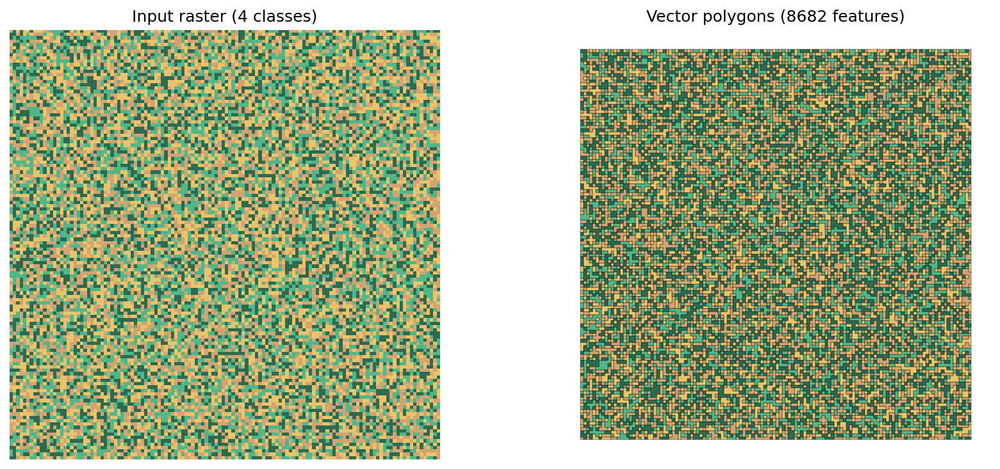
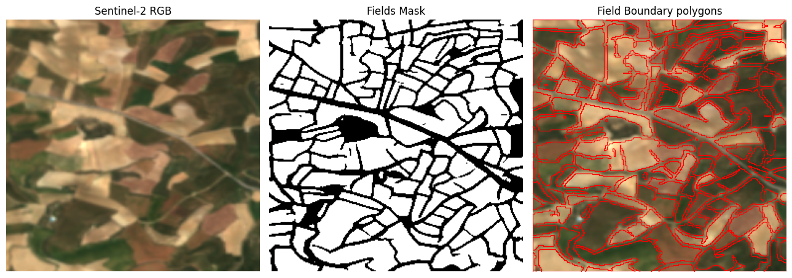

# contourrs

**Fast raster polygonization and contouring in pure Rust with Python bindings.**

Drop-in replacement for `rasterio.features.shapes` — no GDAL dependency.

## Install

```bash
pip install contourrs
```

## Quick example

```python
import numpy as np
from contourrs import shapes

raster = np.array([[1, 1, 2], [1, 2, 2], [3, 3, 3]], dtype=np.uint8)

for geojson, value in shapes(raster, connectivity=4):
    print(f"value={value}, type={geojson['type']}")
```

## What it does

Converts discrete/categorical rasters (segmentation masks, land cover, classified imagery) into vector polygons with their pixel values. Also supports continuous-field contouring (DEMs, probability maps, heatmaps) via marching squares isobands.

Built for the **ML-to-GIS pipeline**: model inference output goes in, GeoJSON or GeoParquet comes out.

{ width="600" }

{ width="600" }

## Real-world examples

{ width="900" }

{ width="900" }

{ width="900" }

## Highlights

- **No GDAL** — pure Rust core, zero system dependencies
- **Fast** — up to 7.5x faster than rasterio with Arrow output
- **Zero-copy Arrow** — GeoParquet-ready tables via Arrow C Data Interface
- **Near-zero memory** — `shapes_arrow()` uses <0.1MB Python-side even on 2048x2048 grids
- **Drop-in compatible** — `shapes()` signature matches `rasterio.features.shapes`
- **Contours** — marching squares isobands with sub-pixel interpolation
- **All dtypes** — uint8/16/32, int16/32, float32/64

## Acknowledgments

Built by [Isaac Corley](https://github.com/isaaccorley) with [Claude](https://claude.ai) as an AI pair-programmer. The Rust core, Python bindings, and packaging were developed iteratively with human-in-the-loop feedback and review.

## License

Apache-2.0
