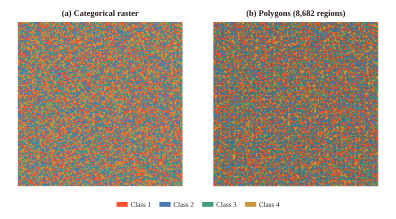
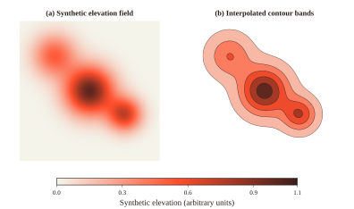
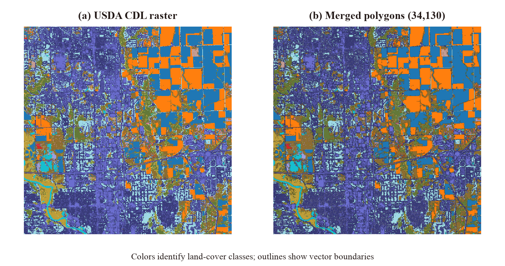
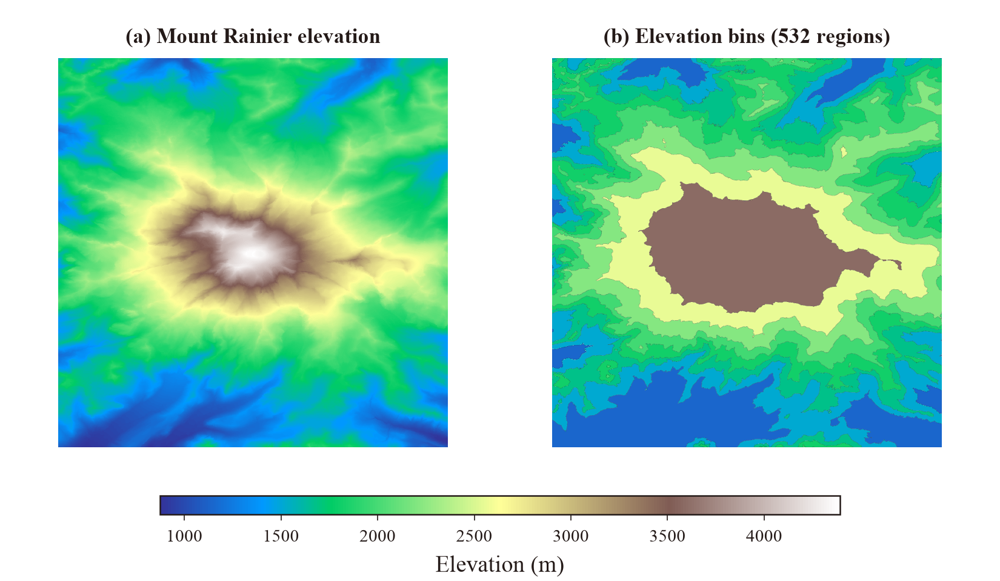
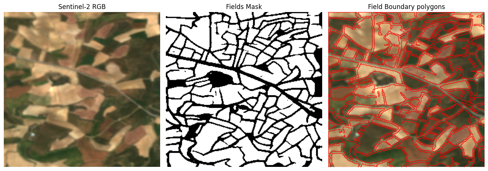

# contourrs

{ width="600" }

contourrs converts NumPy rasters into polygons using a Rust core with Python bindings.
The package has no GDAL dependency.

## Install

```bash
pip install contourrs
```

## Quick example

```python
import numpy as np
from contourrs import shapes

raster = np.array([[1, 1, 2], [1, 2, 2], [3, 3, 3]], dtype=np.uint8)

for geojson, value in shapes(raster, connectivity=4):
    print(f"value={value}, type={geojson['type']}")
```

## Raster operations

Use `shapes()` for categorical rasters such as segmentation masks and land-cover maps.
Use `contours()` for filled contour bands from elevation, probability, or other continuous fields.
Both functions return GeoJSON geometries; their `_arrow` variants return tables that can be written to GeoParquet.

{ width="660" }

Polygonization preserves the pixel boundaries of this synthetic four-class raster.
Colors identify classes, and thin outlines show the extracted regions.

{ width="660" }

Marching squares interpolates band boundaries between raster samples.
The synthetic field and bands share a value scale; white areas lie below the first threshold.

## Real-world examples

### Land cover
{ width="660" }

A 512x512 crop of the 2023 USDA CDL for Polk County, Iowa, polygonized in 128x128 tiles.
Dissolving adjacent regions of the same class removes tile seams.

### Elevation
{ width="660" }

A 2048x2048 USGS 3DEP crop divided into eight quantile-based elevation bins.
This example traces the binned pixel footprints; the [DEM tutorial](tutorials/dem_contour.md) demonstrates interpolated contour bands.

### Field segmentation
{ width="900" }

## Output and compatibility

- The Rust core requires no GDAL or other system libraries.
- Arrow output was 7.5x faster than rasterio on the historical CDL benchmark; see [performance](performance.md) for the setup.
- Arrow tables cross the Rust–Python boundary through the Arrow C Data Interface without copying their buffers.
- `shapes_arrow()` keeps Python-managed allocation near zero in the historical `tracemalloc` benchmark, but native and total process memory are higher.
- `shapes()` resembles `rasterio.features.shapes` for NumPy arrays, but returns an eager list rather than an iterator.
- Marching squares interpolates contour-band boundaries between raster samples.
- Accepted dtypes are uint8/16/32, int16/32, and float32/64.

## Acknowledgments

[Isaac Corley](https://github.com/isaaccorley) developed the Rust core, Python bindings, and packaging with [Claude](https://claude.ai) as an AI pair-programmer and reviewed the resulting code.

## License

Apache-2.0
